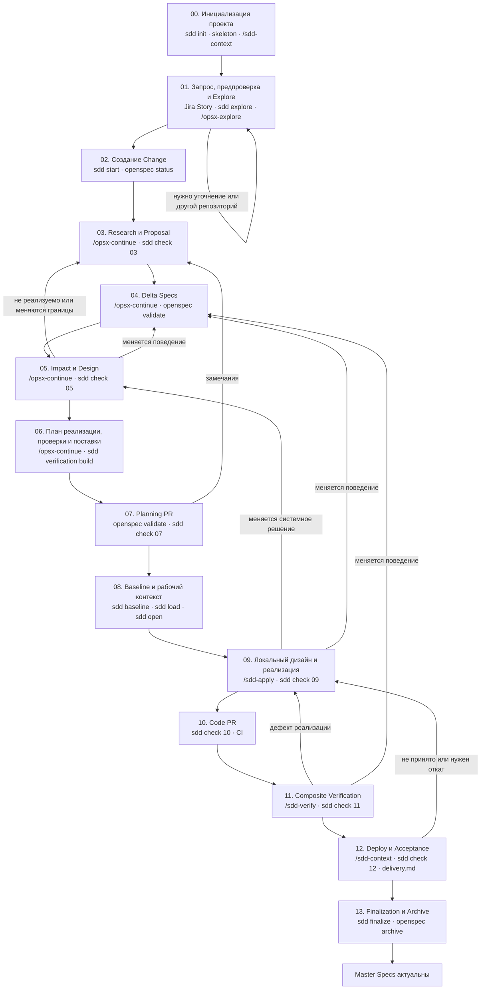

# SDD + OpenSpec: единый рабочий процесс

**Статус:** расширенный черновик для ревью
**Назначение:** провести изменение от запроса до актуальных Master Specs
**Схема OpenSpec:** `multi-repo-sdd`

---

## 1. Правила использования

В проекте действует один процесс и одна полнота спецификации. Разделения на Lite и Full нет. OpenSpec допускает progressive rigor, но в нашем процессе выбор уровня создаёт неоднозначность и возможность пропустить неудобную работу, поэтому все Changes проходят одинаковый маршрут.

Каждый шаг имеет номер. Этот же номер используется:

- в центральной диаграмме;
- в заголовке подробной инструкции;
- после создания Change — в `state.yaml` как текущее состояние шагов 02–13;
- в сообщении проверки `sdd check`;
- в описании возврата при ошибке.

Для каждого шага ниже находятся команды, вход, действия, файлы, владельцы, автоматическая проверка, результат и возвраты. Отдельных таблиц гейтов и артефактов в других частях документа нет.

Все предусмотренные разделы артефактов заполняются. `Not applicable` разрешено только вместе с проверяемой причиной и подтверждением владельца шага. Пустое `N/A`, удаление раздела или формулировка «не требуется» без основания блокируют проверку.

## 2. Роли

| Роль | Ответственность |
|---|---|
| **Change Owner** | Единая продуктовая и аналитическая роль: проблема, границы, наблюдаемое поведение, Requirements, Scenarios и Product Acceptance |
| **Spec Owner** | Целостность Change, корректность процесса, Planning Gate и Finalization |
| **Technical Owner** | Единая роль архитектора и Tech Lead: состав репозиториев, реализуемость, системный и локальный дизайн, Work Packages, владельцы работ и достаточность реализации |
| **Apply Owner** | Разработка по назначенным Work Packages, локальные технические решения в заданных границах, тесты и Implementation Evidence |
| **QA** | Verification Plan, регрессия, Evidence и итог Composite Verification |
| **Release Owner** | Порядок поставки, миграция, флаги, откат и Release Acceptance |
| **Ответственный по ИБ** | Проверка безопасности, данных, приватности, доступов и регуляторных ограничений |

У Change один Change Owner и один Technical Owner. Apply Owner может быть отдельным для каждого Work Package. Technical Owner может получать заключения сопровождающих репозиториев, но итоговое техническое решение и полнота их ответов остаются на нём.

### 2.1. Термины репозиториев

| Термин | Определение |
|---|---|
| **Spec Root Repository** или **корневой репозиторий спецификаций** | Центральный Git-репозиторий со стабильным `repository-id: project-specs`. Он является единственным нормативным источником общего бизнес-контекста, Master Specs, OpenSpec Changes, process schema, системной карты и общих правил SDD. В этом документе выражения «центральный репозиторий», «Spec Root» и `project-specs` обозначают один и тот же репозиторий. |
| **Code Repository** или **кодовый репозиторий** | Зарегистрированный в `sdd.yaml` репозиторий с исходным кодом одной из систем или её части. Он реализует назначенные Work Packages и потребляет бизнес-контекст из Spec Root Repository, но не становится альтернативным источником Master Specs или общего context pack. |
| **Spec checkout** | Изолированная копия Spec Root Repository, открытая на точной Git-ревизии. При реализации используется ревизия Baseline и доступ только для чтения, поэтому бизнес-контекст не меняется из Code Repository. |

Слово Root в термине Spec Root описывает роль источника истины, а не положение каталога на диске и не требование использовать монорепозиторий. Spec Root и Code Repositories являются отдельными Git-репозиториями и могут храниться, клонироваться и версионироваться независимо.

Направление нормативного контекста фиксировано:

1. Spec Root Repository хранит подтверждённый бизнес-, доменный и системный контекст в `openspec/context/`, Master Specs в `openspec/specs/` и планировочные артефакты Changes в `openspec/changes/`.
2. Во время исследования Code Repositories используются как read-only источник фактов о текущей реализации, а подтверждённые глобальные выводы записываются только в Spec Root.
3. После Baseline команда `sdd load` создаёт spec checkout точной ревизии `project-specs`, а `sdd open` подключает его к выбранному Code Repository только для чтения.
4. Code Repository хранит код, локальные тесты, repository card, progress и Implementation Evidence. Он не копирует общий бизнес-контекст как самостоятельную нормативную версию.
5. Если реализация выявила ошибку или пробел в бизнес-контексте, изменение сначала согласуется в Spec Root; Code Repository получает его только через новую подтверждённую ревизию или новый Baseline.

## 3. Единый граф



Переход к подробностям: [00](#00-инициализация-центрального-проекта) → [01](#01-запрос-предпроверка-и-explore) → [02](#02-создание-change) → [03](#03-research-и-proposal) → [04](#04-delta-specs) → [05](#05-system-impact-и-design) → [06](#06-план-реализации-проверки-и-поставки) → [07](#07-planning-pr) → [08](#08-spec-baseline-и-рабочий-контекст) → [09](#09-локальный-дизайн-и-реализация) → [10](#10-code-pr) → [11](#11-composite-verification) → [12](#12-deploy-и-acceptance) → [13](#13-finalization-и-archive).

## 4. Как читать команды

| Вид | Где выполняется | Назначение |
|---|---|---|
| `openspec ...` | Внутри адаптера `sdd` | Core engine: создаёт каркас Change, выдаёт структурированные instructions/status, валидирует и архивирует |
| `/opsx-...` | Чат Qwen Code | Установленное OpenSpec действие: агент читает инструкции и артефакты, затем готовит или проверяет результат |
| `sdd ...` | Терминал | Единая пользовательская обвязка: вызывает OpenSpec под капотом и добавляет Git-контекст, Baseline, репозитории и процессные проверки |
| `/sdd-*` | Чат Qwen Code | Наши агентские команды: ревизия общего контекста, repository-scoped реализация и read-only composite-проверка |
| `git ...`, CI и deploy-команды | Терминал или система автоматизации | Публикация веток, проверки кода и фактическая поставка |

Команды `sdd ...`, `/sdd-context`, `/sdd-apply` и `/sdd-verify` не входят в OpenSpec: это публичный интерфейс встроенной обвязки. Пользователь ведёт процесс через `sdd`; показанные далее вызовы `openspec ...` описывают работу адаптера и нужны для трассировки контракта, а не образуют параллельный пользовательский flow. Пока команда `sdd` не реализована и не прошла contract-тесты, её строка в документе является требованием к инструменту.

OPSX-действие может записывать файлы через агента. Команда `openspec instructions` сама файл не создаёт: для артефакта она возвращает путь результата, шаблон, зависимости, правила и контекст. Специальная поверхность `instructions archive` возвращает только read-only вход финализации: она не архивирует Change и не содержит статический workflow Archive. `/sdd-apply` получает базовые задачи и контекст через `openspec instructions apply`, затем накладывает `repository-id`, неизменяемый Baseline, границы записи и внешний progress. `/sdd-verify` использует OpenSpec validation и данные Change, но состав нескольких code repo и Evidence определяет `sdd`. Штатные `/opsx-apply` и `/opsx-verify` напрямую не запускаются. Команда `sdd check` ничего не исправляет и не принимает решения за владельцев — она только проверяет условия соответствующего гейта.

Общие параметры:

| Параметр | Значение |
|---|---|
| `<ticket-id>` | Постоянный ID запроса в трекере |
| `<change-id>` | ID OpenSpec Change вида `<ticket>-<slug>` |
| `<repository-id>` | Стабильный ID репозитория из `sdd.yaml` |
| `qwen` | Фиксированный идентификатор Qwen Code для настройки OpenSpec и запуска агента |
| `--json` | Машиночитаемый вывод; обвязка разбирает структуру, а не текст терминала |
| `--change <id>` | Явный выбор Change без догадки по текущему каталогу |
| `--repo <id>` | Явный выбор кодового репозитория |
| `--step <id>` | Набор процессных проверок указанного шага или подшага |
| `--type change` | Запрет неоднозначного определения типа объекта |
| `--strict` | Строгая структурная проверка OpenSpec |
| `--no-interactive` | Запрет скрытого диалога; недостающий ввод приводит к отказу |

Нулевой код завершения сторонней диагностической команды сам по себе не считается доказательством успеха. Обвязка проверяет ожидаемую структуру JSON, найденный root, статусы и обязательные поля.

## 00. Инициализация центрального проекта

Инициализация выполняется один раз при создании центрального репозитория и не является шагом обработки отдельной Jira Story или Change. Полный контракт шага находится в [`docs/steps/00.md`](steps/00.md); ниже зафиксированы его связи с остальным flow.

### Владелец

Spec Owner отвечает за нормативную часть, Technical Owner — за карту системы и репозитории, Change Owner — за первичный продуктовый и доменный контекст, Apply Owner — за готовность встроенного `sdd` и среды разработки.

### Команды

Пользователь выполняет в центральном репозитории:

```bash
sdd init
```

Для первичного наполнения общего контекста в агентском чате используется команда без режимов и аргументов:

```text
/sdd-context
```

`sdd init` под капотом инициализирует OpenSpec и раскладывает встроенный skeleton bundle текущей ревизии процесса: schema, templates, agent commands, context pack и README специальных каталогов. Пользователь не настраивает профиль OpenSpec вручную.

Для агентского слоя адаптер использует действия OpenSpec, необходимые текущему процессу:

```text
explore
continue
update
```

Набор внутренних OpenSpec actions является деталью адаптера. Ни одно действие OpenSpec не может обойти `sdd` gates, выбор `repository-id`, точный Baseline и последовательное ревью.

#### Назначение команд

| Команда или действие | Что делает | Изменяет состояние |
|---|---|---|
| `sdd init` | Через адаптер создаёт OpenSpec root и отсутствующие файлы готового skeleton bundle | Не меняет существующие файлы; неизвестные сведения оставляет в inline TODO |
| `/sdd-context` | Сначала инвентаризирует Markdown-файлы `openspec/context/`, затем обрабатывает `_raw/**/*.md` и только после этого остальные пробелы | Предлагает diff context files и ADR для ревью владельцев |

`sdd init` заканчивается после раскладки skeleton. Корректность встроенных schema, templates и commands обеспечивается при разработке bundle. Структурная validation конкретных Changes начинается в последующих шагах.

Назначение выбранных OPSX-действий:

| Действие | Назначение в процессе |
|---|---|
| `explore` → `/opsx-explore` | Исследовать запрос и код без создания Change |
| `continue` → `/opsx-continue` | Подготовить ровно следующий доступный артефакт по графу schema |
| `update` → `/opsx-update <change-id> <уточнение>` | Перечитать зависимости и после подтверждения скорректировать существующие планировочные артефакты; код и отсутствующие артефакты не создаёт |

`/opsx-update` не является переходом между шагами: после изменения артефакта повторяются соответствующие нумерованные гейты и согласования.

### Команда сборки и ревизии контекста

`/sdd-context` вызывает агента, который собирает, проверяет и при необходимости дополняет `openspec/context/`. Отдельных подкоманд для первичного наполнения, релиза и глобального изменения нет. Сразу после вызова агент сначала инвентаризирует структуру и Markdown-файлы. Затем по текущему шагу, контекст-паку, активному Change и `delivery.md` определяет вероятное основание запуска, показывает его пользователю и переходит к обработке содержимого после подтверждения.

Команда хранится в `.qwen/commands/sdd-context.md`: имя файла задаёт вызов `/sdd-context`, а Markdown после YAML frontmatter содержит её полную инструкцию. Это обычная slash-команда Qwen Code, а не skill. Она не вызывает другие кастомные команды, scripts или skills.

Причина определяет момент запуска:

| Основание запуска `/sdd-context` | Когда обязателен | Результат |
|---|---|---|
| Первичное наполнение | Во время инициализации проекта | Контекст-пак создан и заполнен подтверждёнными начальными сведениями |
| Проверка перед релизом | Перед каждым релизом до predeploy-гейта | Подтверждено, что контекст актуален, либо подготовлено его обновление |
| Глобальное изменение | При изменении границ продукта, состава систем, доменной модели, архитектуры, ИБ, общих quality gates или процесса поставки | Затронутые файлы контекст-пака дополнены и согласованы |

При каждом вызове порядок приоритетов фиксирован: **структура и Markdown-файлы → raw-материалы → inline TODO и дополнительный опрос**. Агент не начинает свободный опрос, пока найденные raw-файлы не обработаны или пользователь явно не отложил конкретный материал.

Агент:

1. рекурсивно и только для чтения сканирует `openspec/context/` и строит полный перечень `.md`-файлов;
2. классифицирует пути как нормативный context, ADR, служебный README или raw-материал и отмечает отсутствующие элементы skeleton;
3. читает `00-start-here.md`, inline TODO, README специальных каталогов, `sdd.yaml`, подтверждённый контекст и Master Specs;
4. спрашивает роль пользователя; роль маршрутизирует вопросы, но не заменяет полномочия из CODEOWNERS;
5. получает свежие состояния зарегистрированных Git-репозиториев во временные каталоги;
6. читает все `_raw/**/*.md`, кроме `_raw/README.md`, по одному в устойчивом порядке путей;
7. извлекает из raw отдельные утверждения, предполагаемые целевые файлы и недостающие подтверждения;
8. по каждому утверждению просит пользователя подтвердить, исправить, отклонить или отложить его и при возможности сверяет его с кодом, контрактами, конфигурацией и ADR;
9. после разбора каждого raw-файла показывает diff целевых файлов и применяет подтверждённые изменения до перехода к следующему материалу; неподтверждённое оставляет только в `_raw/`;
10. после обработки или явного откладывания raw-файлов проходит inline TODO и задаёт адресные вопросы по оставшимся разделам skeleton;
11. маршрутизирует устойчивые факты в context files, решения — в ADR, а неизвестное — в TODO целевого файла;
12. обновляет `00-start-here.md` и индекс ADR, показывает оставшийся diff по каждому файлу и применяет только подтверждённые изменения.

Инвентаризация структуры всегда предшествует чтению содержания. Неожиданный Markdown-файл не игнорируется: агент показывает его путь и просит определить назначение до использования содержащихся в нём сведений.

При каждом вызове raw-файлы перечитываются и сравниваются с нормативным контекстом: уже перенесённый факт не дублируется, а новое, изменённое или противоречащее утверждение снова уточняется у пользователя.

Команда не создаёт Requirements, Delta Specs и решения за владельцев. При первичном наполнении она заменяет TODO только подтверждённым содержимым и показывает оставшиеся вопросы. При последующих вызовах без изменений возвращает `context_status: current`, а после принятого diff — `context_status: updated`, ревизию context pack и список изменённых файлов. Результат релизной проверки записывается в раздел `Context review` файла `delivery.md`: `release_id`, `context_revision`, статус, дата и подтверждавшие владельцы.

Если релизная ревизия обнаружила глобальное изменение, релиз останавливается. Изменение продуктового или доменного контекста возвращает Change на шаг 03 или 04; архитектуры, инвариантов или ИБ — на шаг 05; общих quality gates или поставки — на шаг 06. После обновления контекста зависимые артефакты перечитываются и повторно согласуются.

### Команды реализации и составной проверки

`/sdd-apply` и `/sdd-verify` — обычные slash-команды Qwen Code из `.qwen/commands/`, а не самостоятельный core engine. Встроенный `sdd` устанавливает их и через адаптер получает данные OpenSpec. Их инструкции проходят contract-тесты вместе с соответствующими JSON-интерфейсами `sdd instructions apply` и `sdd instructions verify`.

| Команда | Где запускается | Область записи |
|---|---|---|
| `/sdd-apply` | Из code repo после `sdd load` и `sdd open` | Только текущий code repo из `allowed_edit_roots`; spec checkout всегда read-only |
| `/sdd-verify` | Из verification workspace после `sdd verify load` и `sdd verify open` | Не записывает код или планировочные артефакты; возвращает отчёт для решения QA |

Обе команды fail-closed проверяют версию runtime-контракта, Change ID, Baseline и manifest до чтения рабочих файлов. Отсутствующий или неизвестный runtime-параметр не угадывается из cwd или истории чата.

### Структура центрального репозитория

```text
project-specs/
├── openspec/
│   ├── config.yaml
│   ├── context/
│   │   ├── 00-start-here.md
│   │   ├── 01-product-context.md
│   │   ├── 02-domain-glossary.md
│   │   ├── 03-architecture.md
│   │   ├── 04-domain-model.md
│   │   ├── 05-security-and-compliance.md
│   │   ├── 06-cross-system-invariants.md
│   │   ├── 07-quality-gates.md
│   │   ├── 08-release-process.md
│   │   ├── system-map.yaml
│   │   ├── ADR/
│   │   │   └── README.md
│   │   └── _raw/
│   │       └── README.md
│   ├── schemas/
│   │   └── multi-repo-sdd/
│   │       ├── schema.yaml
│   │       └── templates/
│   ├── specs/
│   └── changes/
├── .qwen/
│   └── commands/
│       ├── opsx-explore.md
│       ├── sdd-context.md
│       ├── sdd-apply.md
│       └── sdd-verify.md
├── sdd.yaml
├── CODEOWNERS
└── .gitignore
```

Файлы `00-start-here.md`–`08-release-process.md`, `system-map.yaml` и два README создаются с готовой структурой, инструкциями и локальными `TODO`, а не пустыми. `sdd init` не проверяет и не перезаписывает существующее содержимое: он добавляет только отсутствующие элементы skeleton bundle.

Доступ к зарегистрированным репозиториям выполняется через read-only credential: service account token, deploy key или эквивалент. Credential хранится только в secret storage или переменных среды и не записывается в `sdd.yaml`, runtime manifest, логи или Git.

В Git входят schema, templates, agent commands, подтверждённый context pack, `_raw/`, ADR, Master Specs, process configuration, progress и Evidence. `.gitignore` содержит только точные пути временных клонов и checkout, runtime manifest, кэшей, логов и локальных секретов; каталоги `.qwen/`, `openspec/` и `.sdd/` целиком не игнорируются.

### Откуда берётся контекст

Отдельной папки `docs/` и постоянной копии контекста нет. Каждый вид информации читается из своего источника:

| Информация | Источник истины |
|---|---|
| Шаги процесса | Встроенная ревизия процесса `sdd`, указанная в `sdd.yaml` |
| Репозитории, их URL и основные ветки | `sdd.yaml` |
| Продуктовый и системный контекст | `openspec/context/` |
| Реальная структура, зависимости и контракты | Свежие состояния зарегистрированных Git-репозиториев |
| Действующее поведение системы | OpenSpec Master Specs |
| Исследование, влияние и новое поведение | Артефакты текущего `openspec/changes/<change-id>/` |
| Владельцы файлов и согласования | `CODEOWNERS` и роли текущего Change |
| Поддерживаемая версия OpenSpec и ревизия процесса | Секция `versions` в `sdd.yaml` и Git-ревизия центрального репозитория |
| Совместимость OpenSpec, schema и agent commands | Тесты встроенного skeleton bundle при разработке и выпуске `sdd` |

На этапе Explore временный контекст собирается из свежего кода, Master Specs и текущего запроса. Его можно кешировать для скорости, но он не коммитится и не становится источником истины.

### Что находится в `openspec/context/`

Это контекст-пак проекта внутри `openspec/`, а не общий каталог документации. Он хранит подтверждённые сведения, необходимые агенту до чтения конкретного Change. Сама структура папки и маршрутизация файлов — наше расширение; OpenSpec подключает её через короткий `context` в `config.yaml`.

| Файл | Содержимое | Владелец |
|---|---|---|
| `00-start-here.md` | Порядок чтения, таблица «артефакт → контекст» и временный раздел `Open questions` для ещё не маршрутизированных вопросов | Spec Owner |
| `01-product-context.md` | Назначение продукта, пользователи, ключевые бизнес-сценарии, границы, бизнес-ограничения и известные ограничения | Change Owner |
| `02-domain-glossary.md` | Только специфичные для проекта или неоднозначные термины с единым нормативным значением | Change Owner |
| `03-architecture.md` | Системы, границы, интеграционные стили, архитектурные инварианты, обязательные и запрещённые паттерны, ссылки на нормативные схемы | Technical Owner |
| `04-domain-model.md` | Сущности, состояния, жизненные циклы и отношения предметной области | Change Owner |
| `05-security-and-compliance.md` | Данные, доступы, аудит, приватность, регуляторные ограничения, безусловные запреты и зоны без автономии агента | Ответственный по ИБ |
| `06-cross-system-invariants.md` | Условия, которые должны одновременно сохраняться в нескольких системах | Technical Owner |
| `07-quality-gates.md` | Критичные сценарии, стратегия проверок и общие требования к тестам и Evidence, не зависящие от отдельной фичи | QA |
| `08-release-process.md` | Среды, общие правила поставки, миграции, флагов и отката | Release Owner |
| `system-map.yaml` | Машиночитаемые связи систем, внешних участников и repository ID из `sdd.yaml` | Technical Owner |
| `ADR/README.md` и ADR | Один README с правилами, минимальным шаблоном и всеми демонстрационными примерами; отдельные файлы создаются только для принятых долговечных решений | Technical Owner |
| `_raw/README.md` и raw-файлы | Назначение, правила и неподтверждённые исходные материалы | Автор материала; `/sdd-context` заново читает все raw-файлы при каждом вызове |

Контекст-пак хранит только долговечные общие правила. Команды сборки, линтинга и тестов остаются в code repositories и их CI configuration. История ошибок не ведётся отдельным нормативным журналом: подтверждённый вывод из инцидента переносится в подходящий context-файл, ADR или Master Spec.

`00-start-here.md` не пересказывает остальные файлы. Он задаёт минимальный набор чтения:

| Создаваемый артефакт | Контекст |
|---|---|
| `research.md`, `proposal.md`, Delta Specs | `01-product-context.md`, `02-domain-glossary.md`, `04-domain-model.md`, `06-cross-system-invariants.md` и подходящие Master Specs |
| `system-impact-analysis.md`, `design.md` | `03-architecture.md`, `05-security-and-compliance.md`, `06-cross-system-invariants.md`, `system-map.yaml` и релевантные ADR |
| `tasks.md`, `verification.md` | `07-quality-gates.md` и уже принятые артефакты Change |
| `delivery.md` | `05-security-and-compliance.md`, `08-release-process.md` и принятый Design |

Весь каталог в prompt не вставляется. Агент читает только набор для текущего артефакта. Исключение — служебная инвентаризация `/sdd-context`: она рекурсивно перечисляет пути `.md`, не загружая всё содержимое одновременно. Затем агент последовательно читает все raw-файлы; пользователь может явно отложить конкретный материал. Содержимое raw не считается подтверждённым фактом до уточнения, проверки источников и согласования владельцем.

Если обнаружен пробел, `/sdd-context` записывает inline TODO с владельцем и ожидаемым источником в целевой context-файл. Пока целевой файл неизвестен, вопрос остаётся в `Open questions` файла `00-start-here.md`. Подтверждённый устойчивый факт переносится в соответствующий нормативный файл, а долговечное решение — в ADR. Неподтверждённое остаётся в `_raw/`. Требования конкретной фичи и Delta Specs команда не создаёт.

При расхождении источников агент не выбирает молча: расхождение кода с Master Specs фиксируется в `research.md`, а устаревший контекст-пак исправляется тем же Planning PR. Долговечное наблюдаемое поведение хранится в Master Specs; контекст-пак объясняет продукт, систему и ограничения, но не дублирует Requirements.

### Конфиги

`openspec/config.yaml` выбирает schema и передаёт OpenSpec короткий постоянный контекст:

```yaml
schema: multi-repo-sdd

context: |
  Перед созданием артефакта прочитай openspec/context/00-start-here.md
  и загрузи только назначенные им файлы для текущего артефакта.
  Спецификации нескольких кодовых репозиториев находятся в центральном репозитории project-specs.
  Requirements описывают наблюдаемое поведение без деталей реализации.
  Master Specs меняются только на шаге 13.
```

`sdd.yaml` хранит только версии и репозитории:

```yaml
version: 1

versions:
  process: draft
  openspec: "1.7.0"

repositories:
  - id: project-specs
    url: "<git-url>"
    default_branch: main
  - id: ui
    url: "<git-url>"
    default_branch: main
  - id: backend
    url: "<git-url>"
    default_branch: main
```

Capabilities, Scenarios, исключения и состояние Changes в `sdd.yaml` не хранятся.

### Custom schema

```yaml
name: multi-repo-sdd
version: 1
description: Complete SDD workflow for one or more repositories

artifacts:
  - id: research
    generates: research.md
    description: Подтверждённое исследование запроса и существующей системы
    template: research.md
    requires: []

  - id: proposal
    generates: proposal.md
    description: Цель, ожидаемый результат и границы изменения
    template: proposal.md
    requires: [research]

  - id: specs
    generates: specs/**/*.md
    description: Delta Specs с наблюдаемыми Requirements и Scenarios
    template: spec.md
    requires: [proposal]

  - id: impact
    generates: system-impact-analysis.md
    description: Влияние изменения на системы, репозитории и контракты
    template: system-impact-analysis.md
    requires: [research, proposal, specs]

  - id: design
    generates: design.md
    description: Принятое системное техническое решение
    template: design.md
    requires: [specs, impact]

  - id: tasks
    generates: tasks.md
    description: Work Packages и порядок реализации
    template: tasks.md
    requires: [specs, impact, design]

  - id: verification
    generates: verification.md
    description: План проверки поведения и технических критериев
    template: verification.md
    requires: [specs, tasks]

  - id: delivery
    generates: delivery.md
    description: План слияния, поставки, наблюдения и отката
    template: delivery.md
    requires: [impact, design, tasks]

apply:
  requires: [tasks, verification, delivery]
  tracks: tasks.md

```

Каждый template содержит обязательные разделы, указанные в соответствующем шаге ниже. Schema задаёт порядок подготовки планировочных артефактов, а процессные гейты выполняются в нумерованных шагах. Секция `apply` нужна адаптеру для `openspec instructions apply`; при этом `tasks.md` после Baseline остаётся неизменяемым. Прогресс OpenSpec не является источником истины: `sdd` фильтрует Work Packages по отдельному repository-scoped progress.

### Результат шага 00

- готовый skeleton bundle создан и находится в Git;
- `00-start-here.md` объясняет маршрутизацию и порядок чтения контекста;
- неизвестные сведения представлены inline TODO с владельцами и ожидаемыми источниками;
- первичный `/sdd-context` наполнил доступный подтверждённый контекст;
- `_raw/` отделён от нормативных фактов;
- ADR создаются только из подтверждённого контекста;
- Spec Owner просмотрел diff и разрешил перейти к первому рабочему запросу;
- initialization PR слит в основную ветку.

Завершение фиксируется слитым initialization PR и решением Spec Owner. Оставшиеся TODO допустимы, если у каждого есть владелец и они не блокируют понимание первого запроса.

## 01. Запрос, предпроверка и Explore

Шаг выполняется для каждого запроса, запущенного во внешнем процессе с Jira ticket key после завершения шага 00. Он фиксирует переданный ticket key, при необходимости готовит свежий read-only workspace и исследует проблему без создания Git-ветки, PR, `openspec/changes/`, `state.yaml` или планировочных артефактов. Полный контракт шага находится в [`docs/steps/01.md`](steps/01.md); ниже зафиксированы его связи с остальным flow.

### Владелец

Change Owner отвечает за Jira Story, проблему, ожидаемый результат, исходный выбор репозиториев и решение о продолжении. Technical Owner и Spec Owner не являются обязательными участниками шага; Change Owner обращается к ним адресно только при блокирующем техническом вопросе.

### Команды

```bash
sdd explore --ticket <ticket-id>
```

После успешной подготовки используется управляемое действие OpenSpec, подключённое адаптером:

```text
/opsx-explore <ticket-id>
```

`sdd explore` проверяет формат ticket key и отсутствие точного дубликата, получает через OpenSpec список Master Specs, предлагает интерактивно выбрать Code Repositories и при необходимости атомарно публикует их свежие checkout по детерминированному пути ticket. Пустой выбор означает Explore только по `project-specs`; неинтерактивный запуск запрещён. OpenSpec сам не управляет свежестью Git, поэтому свежесть выбранного кода обеспечивает `sdd`.

#### Назначение команд

| Команда | Что делает | Результат |
|---|---|---|
| `sdd explore --ticket <ticket-id>` | Проверяет среду, key и существующие Changes, интерактивно выбирает Code Repositories и при необходимости получает их свежие ревизии | Атомарно подготовленный read-only workspace без manifest |
| `/opsx-explore <ticket-id>` | Читает запрос, нормативные источники и подготовленный код; не создаёт Change и не изменяет файлы | Структурированный итог для решения Change Owner |

### Вход

- initialization PR шага 00 слит, а Spec Owner разрешил принимать рабочие запросы;
- постоянный Jira key вида `PAY-412`, переданный инициатором как внешний идентификатор запуска работы;
- сформулированная и переданная агенту проблема и ожидаемый результат без обязательства использовать заранее выбранное решение;
- назначенный Change Owner и инициатор;
- зарегистрированный `project-specs`, а при необходимости чтения кода — Code Repositories и read-only Git credential.

### Действия

1. Убедиться, что шаг 00 завершён и инициатор передал ticket key для запуска работы.
2. Синтаксически проверить переданный ticket key; активный Change с тем же ticket или невалидное состояние существующего Change блокирует Explore, архивный требует явного интерактивного подтверждения.
3. В checklist `sdd.yaml` выбрать Code Repositories либо явно подтвердить пустой набор для Explore только по `project-specs`.
4. При непустом выборе получить основные ветки выбранных репозиториев и проверить полные Git-ревизии; атомарно опубликовать read-only workspace `.sdd/checkouts/explore/<ticket-id-lowercase>/`. Точный путь `.sdd/checkouts/` игнорируется Git.
5. Запустить `/opsx-explore <ticket-id>`, прочитать назначенный нормативный контекст, подходящие Master Specs и `Purpose` capabilities.
6. По `system-map.yaml`, Master Specs и свежему коду уточнить репозитории-кандидаты и внешние системы, исследовать текущее поведение, контракты, альтернативы и неизвестные.
7. Если нужен дополнительный репозиторий, повторить `sdd explore`, подтвердить полный расширенный набор и заново провести Explore.
8. Не изменять context pack, Master Specs, Changes и код. Блокирующий вопрос вернуть Change Owner для уточнения; остальные вопросы включить в итог и позднее перенести в `research.md`.
9. Сформировать структурированный итог с проблемой, результатом, источниками, репозиториями и ревизиями, текущим поведением, альтернативами, вопросами и блокерами.
10. Если гейт выполнен, Change Owner разрешает перейти к созданию Change на шаге 02; иначе получает недостающую информацию и продолжает Explore.

### Результат и гейт 01

Результат шага пока не является Change. Он существует в агентской сессии; временный workspace служит рабочей средой исследования. Постоянный SDD-артефакт, runtime manifest, Git-ветка и PR не создаются. SDD не читает и не изменяет Jira и не управляет статусом внешней задачи.

Продолжение разрешено, когда:

- инициатор передал ticket key как внешний идентификатор запуска работы;
- проблема и ожидаемый результат понятны;
- активного Change с тем же ticket нет;
- подходящие нормативный контекст и Master Specs прочитаны;
- Explore выполнен по `project-specs`, а выбранные Code Repositories имеют зафиксированные точные ревизии;
- известны репозитории-кандидаты и внешние системы;
- блокирующих неизвестных нет, остальные вопросы имеют владельцев;
- Change Owner разрешил перейти к созданию Change на шаге 02.

Если данных недостаточно, Explore остаётся незавершённым и Change Owner получает недостающую информацию без создания PR. Отмена, закрытие или отправка исходной задачи на доработку относятся к внешнему процессу. Если поведение уже описано и код ему не соответствует, Change Owner решает, продолжать ли запрос как исправление дефекта. Подтверждённое общее знание обновляет context pack позднее в составе Planning PR; глобальное обслуживание контекста вне конкретного тикета не относится к шагу 01.

## 02. Создание Change

### Владелец

Spec Owner.

### Команды

```bash
sdd start <ticket-id> <short-slug>
openspec status --change <change-id> --json
```

`sdd start` выполняет:

```bash
openspec new change <change-id> --schema multi-repo-sdd --json
```

#### Назначение команд

| Команда | Что делает | Результат |
|---|---|---|
| `sdd start <ticket-id> <short-slug>` | Принимает Jira key из аргумента `<ticket-id>`, формирует и проверяет `change-id`, вызывает OpenSpec, затем сама создаёт `state.yaml` и записывает в него `ticket: <ticket-id>`, `step: "02"` и `status: draft`; агент и человек этот файл вручную не заполняют | Новый Change, однозначно связанный с Jira Story |
| `openspec new change <change-id> --schema multi-repo-sdd --json` | Штатно создаёт Change по нашей schema; вызывается внутри `sdd start`, а не вручную | OpenSpec-каркас Change и metadata выбранной schema |
| `openspec status --change <change-id> --json` | Читает граф артефактов и показывает, что готово, доступно или заблокировано зависимостями | Проверка, что создан правильный Change и первым доступен Research |

### Вход

Принятый результат шага 01.

### Действия

1. Сформировать `<change-id>` в lowercase kebab-case: `<ticket>-<slug>`.
2. Проверить ID среди активных и архивных Changes.
3. Создать Change через OpenSpec с schema `multi-repo-sdd`.
4. Создать `state.yaml` детерминированным кодом, а не агентом.
5. Записать связь с тикетом.

### Файлы

```text
openspec/changes/<change-id>/
├── .openspec.yaml
└── state.yaml
```

Минимальное состояние:

```yaml
step: "02"
status: draft
ticket: <ticket-id>
planning_pr: null
spec_baseline: null
blocked:
  reason: null
  owner: null
  review_on: null
  resume_step: null
acceptance:
  product: pending
  release: pending
```

### Результат и гейт 02

- Change ID уникален;
- schema разрешается из проекта;
- Change Owner подтвердил связь ticket key с существующей Jira Story;
- `state.yaml` валиден;
- `openspec status` показывает `research` следующим доступным артефактом.

При конфликте ID исправляется slug. Второй Change по тому же системному изменению не создаётся.

## 03. Research и Proposal

### Владелец

Spec Owner ведёт шаг; Change Owner принимает Proposal; Technical Owner подтверждает технические факты.

### Команды

Для `research.md`:

```text
/opsx-continue
```

```bash
openspec instructions research --change <change-id> --json
sdd check --change <change-id> --step 03-research
```

После принятия Research — для `proposal.md`:

```text
/opsx-continue
```

```bash
openspec instructions proposal --change <change-id> --json
sdd check --change <change-id> --step 03-proposal
```

#### Назначение команд

| Команда | Что делает | Почему отдельный вызов |
|---|---|---|
| `/opsx-continue` для Research | Определяет первый доступный артефакт по schema и поручает агенту создать `research.md` | Research просматривается до Proposal |
| `openspec instructions research --change <change-id> --json` | Возвращает шаблон, путь, правила и доступный контекст для Research | Агент и обвязка работают по одному контракту |
| `sdd check --change <change-id> --step 03-research` | Проверяет источники, исследованные репозитории, факты, альтернативы, неизвестные и владельцев вопросов | Блокирует решение на неподтверждённом исследовании |
| `/opsx-continue` для Proposal | После принятого Research поручает агенту создать следующий `proposal.md` | Остальные артефакты не создаются пакетом |
| `openspec instructions proposal --change <change-id> --json` | Выдаёт контракт Proposal с Research как зависимостью | Делает вход Proposal явным |
| `sdd check --change <change-id> --step 03-proposal` | Проверяет проблему, результат, scope, non-scope и решения владельцев | Закрывает шаг только после принятого Proposal |

### Вход

Change шага 02 и выводы Explore.

### `research.md`

Обязательно содержит:

- исходную проблему;
- прочитанные Master Specs;
- исследованные репозитории с ветками и ревизиями;
- просмотренные контракты и системные документы;
- найденные ограничения и legacy-зависимости;
- рассмотренные альтернативы;
- подтверждённые факты;
- неподтверждённые предположения;
- вопросы, владельцев и срок ответа.

### `proposal.md`

Обязательно содержит:

- проблему и текущие последствия;
- измеримый или наблюдаемый результат;
- scope;
- non-scope;
- затронутые существующие capabilities;
- новые capabilities с `Purpose` и причиной, если они действительно нужны;
- заинтересованные команды и внешние системы;
- ограничения;
- критерии остановки или отмены.

Capability выбирается непосредственно из `openspec/specs/`. Отдельного реестра нет. Новая capability разрешена только после письменного сравнения с существующими `Purpose` и решения Spec Owner.

### Результат и гейт 03

- каждый факт имеет источник;
- у каждого вопроса есть владелец;
- Proposal не содержит деталей реализации;
- scope и non-scope не пересекаются;
- Change Owner подтвердил проблему и результат;
- Technical Owner подтвердил исследованные технические факты;
- Spec Owner подтвердил capabilities.

При изменении проблемы или границ шаг 03 повторяется. Изменения вниз по графу не исправляются локально, пока Proposal снова не принят.

После гейта `state.yaml.step` становится `03`, статус — `proposal_approved`.

## 04. Delta Specs

### Владелец

Change Owner готовит и принимает наблюдаемое поведение, Requirements и Scenarios; QA подтверждает проверяемость; Technical Owner подтверждает техническую непротиворечивость без подмены поведения реализацией.

### Команды

```text
/opsx-continue
```

```bash
openspec instructions specs --change <change-id> --json
openspec validate <change-id> --type change --strict --json --no-interactive
sdd check --change <change-id> --step 04
```

#### Назначение команд

| Команда | Что делает | Результат |
|---|---|---|
| `/opsx-continue` | Поручает агенту создать следующий доступный артефакт `specs` | Delta Specs по выбранным Master Specs |
| `openspec instructions specs --change <change-id> --json` | Возвращает формат дельт, шаблон, зависимости и Proposal как контекст | Точный контракт для агента |
| `openspec validate <change-id> --type change --strict --json --no-interactive` | Строго проверяет структуру Change, операции дельты, Requirements и Scenarios без интерактивных догадок | Машиночитаемый отчёт OpenSpec |
| `sdd check --change <change-id> --step 04` | Проверяет наши нормы содержания, полноту поведения и обязательные согласования | Процессный гейт поверх структурной validation OpenSpec |

### Вход

Принятый Proposal.

### Действия

1. Создать Delta Spec для каждой затронутой capability.
2. Использовать нативные операции OpenSpec: `ADDED`, `MODIFIED`, `REMOVED`, `RENAMED`.
3. Описать наблюдаемое обязательство в каждом Requirement.
4. Добавить минимум один Scenario с условиями, событием и результатом.
5. Описать основной путь, границы, ошибки, отказные режимы и совместимость.
6. Добавить требования по безопасности, приватности, данным и доступам либо фактическое обоснование их неприменимости.
7. Не включать классы, методы, файлы, библиотеки и шаги реализации.

Scenario ID и составные Scenario Reference не создаются. Scenarios остаются в Delta Specs; шаг 06 сам построит из них Verification Plan.

### Результат и гейт 04

- `openspec validate` успешен без ошибок;
- каждый Requirement имеет нормативное слово и Scenario;
- `MODIFIED` содержит полное будущее состояние изменяемого Requirement;
- объявленные capabilities совпадают с каталогами дельт;
- Master Specs не изменены напрямую;
- Change Owner и QA приняли поведение.

Неясное поведение возвращается в этот шаг. Если меняются цель или scope — возврат на 03.

После гейта `state.yaml.step` становится `04`, статус — `specs_approved`.

## 05. System Impact и Design

### Владелец

Technical Owner единолично отвечает за технический результат шага. Он собирает заключения сопровождающих репозиториев, Release Owner и ИБ, но не передаёт им ответственность за целостность решения.

### Команды

Для `system-impact-analysis.md`:

```text
/opsx-continue
```

```bash
openspec instructions impact --change <change-id> --json
sdd check --change <change-id> --step 05-impact
```

После принятия Impact — для `design.md`:

```text
/opsx-continue
```

```bash
openspec instructions design --change <change-id> --json
sdd check --change <change-id> --step 05-design
```

#### Назначение команд

| Команда | Что делает | Результат |
|---|---|---|
| `/opsx-continue` для Impact | Поручает агенту создать `system-impact-analysis.md` после готовых Research, Proposal и Delta Specs | Подтверждённая область технического влияния |
| `openspec instructions impact --change <change-id> --json` | Возвращает контракт Impact и пути его зависимостей | Основа для исследования кода и систем |
| `sdd check --change <change-id> --step 05-impact` | Проверяет репозитории, контракты, данные, внешние зависимости, ИБ и реализуемость | Блокирует Design при неизвестном влиянии |
| `/opsx-continue` для Design | После принятого Impact поручает агенту создать `design.md` | Системное решение, отделённое от исследования |
| `openspec instructions design --change <change-id> --json` | Возвращает шаблон Design и принятые зависимости | Проектирование против актуальных Delta Specs и Impact |
| `sdd check --change <change-id> --step 05-design` | Проверяет межрепозиторные решения, совместимость, миграцию, порядок поставки и откат | Принятый Technical Owner System Design |

### `system-impact-analysis.md`

Обязательно содержит:

- все затронутые репозитории и причины;
- точки расширения в коде;
- API, события, данные, конфигурацию и инфраструктуру;
- внешние системы, контакты и подтверждение готовности;
- legacy-зависимости;
- влияние на безопасность и приватность;
- миграции;
- реализуемость каждого элемента;
- ограничения и блокеры;
- итог `feasible`, `feasible_with_conditions` или `not_feasible`.

### `design.md`

Обязательно содержит:

- системный контекст;
- технические решения на границах репозиториев;
- API, события, данные и последовательности;
- совместимость старых и новых компонентов;
- миграцию и восстановление;
- релизный флаг и безопасное выключенное состояние;
- наблюдаемость и критерии остановки;
- откат;
- решения, которые должны быть уточнены в Local Design;
- отдельно порядок слияния PR и порядок развёртывания.

Если пункт неприменим, Technical Owner записывает проверяемую причину. Например: «Миграция данных отсутствует: Delta Specs добавляют только вычисляемое поле ответа; схема хранения не меняется». Формулировка «миграция не нужна» без факта не проходит.

### Результат и гейт 05

- каждый репозиторий подтверждён фактами исследования;
- нет неизвестного владельца внешней зависимости;
- Technical Owner подтвердил реализуемость;
- Design покрывает все границы из Impact;
- порядок merge и порядок deploy заданы отдельно;
- QA подтвердил возможность проверки;
- Release Owner подтвердил поставляемость и откат;
- ИБ подтвердил применимые решения.

`not_feasible` возвращает Change на 03 для изменения границ или отмены. Изменение наблюдаемого поведения возвращает на 04. Неразрешённая внешняя зависимость переводит Change в `blocked` с причиной, владельцем, датой и `resume_step: "05"`.

После гейта `state.yaml.step` становится `05`, статус — `design_approved`.

## 06. План реализации, проверки и поставки

### Владелец

Technical Owner отвечает за `tasks.md`, QA — за `verification.md`, Release Owner — за `delivery.md`. Назначенные Apply Owners подтверждают реализуемость своих Work Packages. Spec Owner проверяет согласованность трёх документов.

### Команды

Для `tasks.md`:

```text
/opsx-continue
```

```bash
openspec instructions tasks --change <change-id> --json
```

Для `verification.md`:

```text
/opsx-continue
```

```bash
openspec instructions verification --change <change-id> --json
sdd verification build --change <change-id>
```

Для `delivery.md`:

```text
/opsx-continue
```

```bash
openspec instructions delivery --change <change-id> --json
sdd check --change <change-id> --step 06
```

#### Назначение команд

| Команда | Что делает | Результат |
|---|---|---|
| `/opsx-continue` | Каждый вызов поручает агенту создать ровно один следующий доступный артефакт: Tasks, Verification или Delivery | Последовательное ревью без пакетной генерации |
| `openspec instructions tasks --change <change-id> --json` | Возвращает правила разбиения Design на Work Packages | Каркас `tasks.md` |
| `openspec instructions verification --change <change-id> --json` | Возвращает правила Verification с Delta Specs и Tasks как контекстом | Каркас `verification.md` |
| `sdd verification build --change <change-id>` | Детерминированно строит строки Verification из всех Delta Scenarios и технических критериев | Полная матрица без ручного пропуска Scenario |
| `openspec instructions delivery --change <change-id> --json` | Возвращает правила подготовки merge, deploy, миграции, флагов, наблюдения и rollback | Каркас `delivery.md` |
| `sdd check --change <change-id> --step 06` | Проверяет согласованность трёх планов, владельцев, зависимости и конкретность команд поставки | Готовность комплекта к Planning PR |

### `tasks.md`

Каждый Work Package содержит:

- ID;
- тип `implements` или `enables`;
- один целевой репозиторий;
- одного владельца;
- проверяемый результат;
- связанные capability и Requirement;
- зависимости;
- входные ограничения;
- критерий готовности.

Technical Owner назначает Apply Owner для каждого Work Package. Пакет не может быть назначен «команде вообще».

### `verification.md`

`sdd verification build` получает Delta Specs из структурного вывода OpenSpec и создаёт строки для всех Scenarios. Человек не переписывает их вручную и не создаёт идентификаторы.

Для каждого Scenario задаются:

- способ проверки;
- тип теста;
- среда;
- необходимые данные;
- ожидаемое Evidence;
- ответственный;
- итоговый статус, пока `Pending`.

Дополнительно обязательны регрессия, контрактные проверки, миграция, безопасность, отказные режимы и безопасное выключенное состояние флага. Неприменимость каждого вида проверки обосновывается фактом.

### `delivery.md`

Обязательно содержит:

- порядок слияния Code PR;
- порядок deploy;
- точные deploy-команды или ссылки на утверждённый pipeline;
- миграционные команды и обратные действия;
- управление релизным флагом;
- критерии остановки;
- rollback-команды;
- мониторинг и пороги;
- план частичного раската;
- Product Acceptance;
- Release Acceptance.

### Результат и гейт 06

- каждый затронутый репозиторий имеет Work Package;
- у каждого пакета есть персональный владелец;
- зависимости не образуют цикл;
- Verification содержит каждый Scenario Delta Specs;
- все виды риска имеют проверку или фактическое обоснование неприменимости;
- Delivery покрывает каждый компонент и миграцию из Design;
- команды deploy и rollback исполнимы в целевом контуре.

Если план нельзя построить, возврат идёт к первому неверному артефакту: 05 для технического решения, 04 для поведения, 03 для границ.

После гейта `state.yaml.step` становится `06`, статус — `plan_ready`.

## 07. Planning PR

### Владелец

Spec Owner ведёт гейт. Обязательные согласующие: Change Owner, Technical Owner, назначенные Apply Owners, QA и Release Owner. ИБ участвует, если затронуты безопасность, данные, приватность, доступы или регуляторные ограничения; факт неприменимости ИБ уже записан на шагах 04–06.

### Команды

```bash
openspec status --change <change-id> --json
openspec validate <change-id> --type change --strict --json --no-interactive
sdd check --change <change-id> --step 07
git push -u origin <planning-branch>
```

Planning PR создаётся через средство хостинга после успешных проверок.

#### Назначение команд

| Команда | Что делает | Результат |
|---|---|---|
| `openspec status --change <change-id> --json` | Показывает готовность всех артефактов по графу schema | Подтверждение, что Planning PR не собирается из неполного Change |
| `openspec validate <change-id> --type change --strict --json --no-interactive` | Повторно выполняет строгую структурную validation на итоговом содержимом ветки | Финальный отчёт OpenSpec перед ревью |
| `sdd check --change <change-id> --step 07` | Проверяет полный процессный комплект, согласованность артефактов и отсутствие прямого изменения Master Specs | Разрешение опубликовать Planning PR |
| `git push -u origin <planning-branch>` | Публикует текущую планировочную ветку и связывает её с remote-веткой | Ветка, из которой средство хостинга создаёт Planning PR |
| Создание PR в Git-хостинге | Запускает CODEOWNERS, обязательные ревью и branch protection | Проверяемое человеческое решение; отдельной универсальной CLI-команды процесс не навязывает |

### Порядок ревью

Ревьюер идёт в том же порядке, что и граф:

```text
research
→ proposal
→ specs
→ system-impact-analysis
→ design
→ tasks
→ verification
→ delivery
```

Замечание ставится к первому артефакту, где возникла ошибка. Исправление нижестоящего документа без исправления его основания запрещено.

### Результат и гейт 07

- все артефакты существуют и приняты владельцами;
- OpenSpec validation и `sdd check` успешны;
- Master Specs в PR не меняются;
- обязательные ревью получены;
- нерешённых обсуждений нет;
- Planning PR слит в защищённую основную ветку.

Замечания возвращают на соответствующий шаг 03–06. После повторного изменения зависимые артефакты перечитываются и пересогласуются.

После слияния `state.yaml.step` становится `07`, статус — `planning_approved`, а `planning_pr` содержит ссылку на PR.

## 08. Spec Baseline и рабочий контекст

### Владелец

Spec Owner разрешает Baseline; Technical Owner подтверждает состав репозиториев; каждый Apply Owner подтверждает полученную repository card и назначенные Work Packages.

### Команды

```bash
sdd baseline create --change <change-id>
sdd load --change <change-id> --repo <repository-id>
sdd check --change <change-id> --repo <repository-id> --step 08
sdd open --change <change-id> --repo <repository-id> --tool qwen
```

`sdd load` создаёт изолированный checkout `project-specs` и переключает его точно на Baseline. `sdd open` запускает агент из корня целевого code repo, разрешает запись только в этот репозиторий и подключает spec checkout как read-only источник. Во время реализации OpenSpec CLI не выбирает область изменения кода: пути, Work Packages и границы записи задаёт только проверенный runtime-контекст нашей обвязки.

Beta Stores, `references`, `openspec context` и `workset` не входят в нормативный процесс. Они не требуются для настройки машины, выполнения Change или гейтов.

`sdd open` не копирует модель workset: у него нет именованных сохранённых представлений, registry, приоритетов разрешения root или пользовательских opener-настроек. Это stateless-запуск только для текущего `.sdd/runtime/context.yaml`. Агент не должен выводить область записи из текущего каталога, соседних checkout или подсказок OpenSpec: действительны только `allowed_edit_roots` и `read_only_roots` из runtime-контекста.

#### Назначение команд

| Команда | Что делает | Результат |
|---|---|---|
| `sdd baseline create --change <change-id>` | Проверяет слитый Planning PR и актуальную основную ветку, создаёт следующий неизменяемый Git-тег Baseline и подтверждает его на remote | Точная ревизия требований для реализации |
| `sdd load --change <change-id> --repo <repository-id>` | Создаёт отдельный spec checkout на Baseline, выбирает Work Packages репозитория, генерирует карточку и runtime-контекст, инициализирует локальные Progress и Evidence | Воспроизводимый локальный контекст одного репозитория |
| `sdd check --change <change-id> --repo <repository-id> --step 08` | Проверяет тег, SHA, пути, карточку, принадлежность Work Packages и читаемость OpenSpec root | Fail-closed разрешение запуска агента |
| `sdd open --change <change-id> --repo <repository-id> --tool qwen` | Повторно валидирует runtime-контекст, запускает выбранный агент из корня code repo и подключает spec checkout только для чтения | Изолированная сессия реализации с одной областью записи и без Store registry |

### Baseline

Формат тега:

```text
spec-baseline/<change-id>/vN
```

Тег ставится на merge commit Planning PR, не перемещается и не удаляется. После изменения `proposal.md`, Delta Specs, Impact, Design, Tasks, Verification или Delivery создаётся новый Planning PR и следующий Baseline.

### Карточка кодового репозитория

```yaml
change_id: pay-412-role-model
spec_baseline: spec-baseline/pay-412-role-model/v1
repository: ui
work_packages: [UI-01]
cancelled: false
```

Карточку создаёт `sdd load`; вручную она не редактируется.

Она хранится в `.sdd/change.yaml` кодового репозитория и коммитится вместе с реализацией.

### Локальные данные рабочего контекста

```text
.sdd/
├── change.yaml
├── local-design.md
├── implementation-plan.md
├── progress.yaml
├── implementation-evidence.yaml
├── spec-checkouts/
│   └── <change-id>/<repository-id>/<baseline>/
└── runtime/
    └── context.yaml
```

`change.yaml`, `local-design.md`, `implementation-plan.md`, `progress.yaml` и `implementation-evidence.yaml` коммитятся вместе с реализацией. `spec-checkouts/` и `runtime/` игнорируются Git: это воспроизводимые локальные данные, а не новые проектные конфиги.

`tasks.md` после создания Baseline не используется как журнал исполнения и не получает task-checkboxes от code repo. `progress.yaml` хранит состояние только назначенных этому репозиторию Work Packages:

```yaml
version: 1
change_id: pay-412-role-model
repository: ui
spec_baseline: spec-baseline/pay-412-role-model/v1
work_package_digest: "<digest-from-baseline>"
work_packages:
  - id: UI-01
    status: pending
    completed_items: []
```

Допустимые локальные статусы Work Package: `pending`, `in_progress`, `implemented`, `blocked`, `cancelled`. `/sdd-apply` может переводить пакет в `implemented` только после выполнения его локальных критериев и записи Evidence. Итог Composite Verification хранится централизованно в `verification.md` и `state.yaml`, а не записывается задним числом в уже слитые code repo. При новом Baseline `sdd load` сохраняет прогресс лишь для Work Package с тем же ID и тем же `work_package_digest`; изменившийся пакет возвращается в `pending`.

`implementation-evidence.yaml` содержит только проверяемые ссылки на результат этого репозитория:

```yaml
version: 1
change_id: pay-412-role-model
repository: ui
spec_baseline: spec-baseline/pay-412-role-model/v1
repository_revision: null
code_pr: null
work_packages:
  - id: UI-01
    commits: []
    checks: []
    artifacts: []
    deviations: []
```

Каждая запись `checks` содержит точную команду или pipeline job, результат, дату и ссылку на сохранённый лог. Агент не превращает собственное утверждение в Evidence.

`runtime/context.yaml` содержит только данные текущего запуска:

```yaml
version: 1
change_id: pay-412-role-model
repository: ui
spec_baseline: spec-baseline/pay-412-role-model/v1
spec_revision: "<commit-sha>"
spec_path: "<absolute-local-path>"
code_path: "<absolute-local-path>"
work_packages: [UI-01]
work_package_digest: "<digest-from-baseline>"
progress_path: "<absolute-code-path>/.sdd/progress.yaml"
evidence_path: "<absolute-code-path>/.sdd/implementation-evidence.yaml"
allowed_edit_roots:
  - "<absolute-code-path>"
read_only_roots:
  - "<absolute-spec-path>"
```

`sdd load` проверяет соответствие `spec_revision` тегу Baseline, вычисляет digest выбранных Work Packages и генерирует индекс релевантных Master Specs, файлов `openspec/context/` и Work Packages. `sdd open` перед запуском повторно проверяет пути, digest и чистоту spec checkout; он отказывает, если любой участник отсутствует, Baseline изменился, spec checkout имеет локальные изменения либо разрешённая область записи шире целевого code repo.

### Результат и гейт 08

- Baseline указывает на слитый Planning PR;
- все кодовые репозитории получили свои Work Packages;
- каждый репозиторий использует отдельный spec checkout на точном Baseline;
- агент запускается из целевого code repo, а spec checkout подключён только для чтения;
- runtime-контекст содержит одну разрешённую область записи и один read-only spec checkout;
- карточка соответствует `tasks.md`;
- локальные Progress и Evidence относятся к тому же Change, репозиторию, Baseline и digest Work Packages;
- `sdd check --step 08` подтверждает ревизию, пути, Work Packages, digest, чистоту spec checkout и границы записи;
- запуск не зависит от глобального registry, Store ID, `defaultStore` или локального workset.

Пропущенный репозиторий возвращает на 05 и требует нового Baseline. Изменение Work Packages возвращает на 06 и требует нового Baseline.

После гейта `state.yaml.step` становится `08`, статус — `baselined`, `spec_baseline` содержит текущий тег.

## 09. Локальный дизайн и реализация

### Владелец

Technical Owner отвечает за соответствие локального решения System Design. Apply Owner выполняет назначенные Work Packages и предоставляет тесты и Implementation Evidence.

### Команды

В контексте, открытом через `sdd open`:

```text
/sdd-apply
```

Для детерминированного получения инструкций:

```bash
sdd instructions apply --change <change-id> --repo <repository-id> --json
sdd check --change <change-id> --repo <repository-id> --step 09
```

#### Назначение команд

| Команда | Что делает | Результат |
|---|---|---|
| `/sdd-apply` | Читает проверенный runtime-контекст, предлагает следующий незавершённый Work Package только текущего репозитория и изменяет файлы только внутри `allowed_edit_roots` | Изменения кода, локальный Progress и проверяемый Evidence без изменения Baseline |
| `sdd instructions apply --change <change-id> --repo <repository-id> --json` | Проверяет карточку, Baseline и digest, затем возвращает только Work Packages выбранного репозитория, read-only пути планировочных артефактов, локальный прогресс и границы записи | Детерминированный вход `/sdd-apply`; при неоднозначности или несовпадении команда отказывает |
| `sdd check --change <change-id> --repo <repository-id> --step 09` | Проверяет Baseline, Local Design, принадлежность Work Packages, тесты и Evidence текущего репозитория | Разрешение готовить Code PR |

`/sdd-apply` через `sdd instructions apply` вызывает `openspec instructions apply --json` для получения нормативных задач и контекста, затем оставляет только Work Packages выбранного `repository-id`. Поля progress из OpenSpec не считаются источником истины, потому что центральный `tasks.md` после Baseline неизменяем; фактический прогресс хранится в repository-scoped `progress.yaml`. Команда выполняет по одному Work Package или локальному item, показывает diff и обновляет progress только после проверки результата. Неизвестный пакет, выход за `allowed_edit_roots`, грязный spec checkout или несовпадение digest являются блокирующей ошибкой.

### Действия

1. Создать `.sdd/local-design.md` для решений внутри репозитория.
2. Создать `.sdd/implementation-plan.md`, разбивающий только назначенные Work Packages на локальные проверяемые items.
3. Проверить оба документа на соответствие System Design, Work Packages и Baseline.
4. Реализовать только назначенные Work Packages и items текущего репозитория.
5. Добавить локальные тесты.
6. После каждого фактического результата обновить `.sdd/progress.yaml` и `.sdd/implementation-evidence.yaml`.
7. Не изменять spec checkout, центральный `tasks.md` и `.sdd/change.yaml` вручную.

### Результат и гейт 09

- локальный дизайн принят Technical Owner;
- локальный Implementation Plan покрывает каждый назначенный Work Package;
- код соответствует текущему Baseline;
- назначенные Work Packages реализованы;
- локальные тесты успешны;
- Evidence ссылается на конкретные коммиты и прогоны;
- spec checkout чист, а центральный `tasks.md` совпадает с Baseline;
- новых системных решений, не отражённых в `design.md`, нет.

Дефект реализации остаётся на шаге 09. Изменение системного решения возвращает на 05. Изменение наблюдаемого поведения возвращает на 04. Новый репозиторий возвращает на 05. Любое изменение нормативных артефактов требует нового Baseline и повторного `sdd load`.

После начала реализации `state.yaml.step` становится `09`, статус — `implementing`.

## 10. Code PR

### Владелец

Apply Owner готовит Code PR и Evidence; Technical Owner принимает технический результат.

### Команды

```bash
sdd check --change <change-id> --repo <repository-id> --step 10
sdd status --change <change-id> --repo <repository-id> --json
git push -u origin <code-branch>
```

Дополнительно выполняются точные CI-команды целевого репозитория, перечисленные в его Local Design или pipeline-конфигурации.

#### Назначение команд

| Команда | Что делает | Результат |
|---|---|---|
| `sdd check --change <change-id> --repo <repository-id> --step 10` | Проверяет карточку, Baseline, digest, Local Design, Implementation Plan, Progress, Evidence и комплект Code PR | Процессный допуск Code PR |
| `sdd status --change <change-id> --repo <repository-id> --json` | Показывает Progress выбранного репозитория и подтверждает согласованность карточки, Baseline, digest и центрального Change | Защита от отменённого, заменённого или изменившегося Change |
| `git push -u origin <code-branch>` | Публикует кодовую ветку и настраивает upstream | Ветка для Code PR |
| CI-команды репозитория | Выполняют сборку, unit-, integration-, contract-, lint- и другие проверки, определённые самим репозиторием | Технические результаты и Evidence; `sdd` не дублирует реализацию CI |

### Содержание Code PR

- Change ID;
- Spec Baseline;
- Work Packages;
- ссылка на Planning PR;
- ссылка на Local Design;
- ссылка на Implementation Plan;
- итоговый Progress назначенных Work Packages;
- Implementation Evidence;
- результаты CI;
- влияние на deploy, миграцию и флаг;
- известные ограничения.

### Результат и гейт 10

- карточка Change валидна;
- PR реализует только назначенные пакеты;
- Baseline не устарел;
- все назначенные пакеты имеют локальный статус `implemented`;
- обязательные тесты и CI успешны;
- Technical Owner подтвердил достаточность реализации;
- порядок слияния соответствует `delivery.md`.

Если новый Baseline опубликован, PR блокируется до обновления карточки и повторной проверки. Если проблема в требованиях или Design, возврат выполняется по правилам шага 09.

После готовности всех Code PR `state.yaml.step` становится `10`, статус — `code_ready`.

## 11. Composite Verification

### Владелец

QA принимает Verification. Apply Owner предоставляет сборки и Implementation Evidence, Technical Owner подтверждает техническую полноту, Change Owner участвует в разборе расхождений бизнес-поведения.

### Команды

Сначала обвязка собирает воспроизводимый read-only контекст всех участвующих репозиториев:

```bash
sdd verification build --change <change-id> --preserve-results
sdd verify load --change <change-id>
sdd verify open --change <change-id> --tool qwen
```

В открытом агентском контексте:

```text
/sdd-verify
```

После отчёта агента:

```bash
sdd instructions verify --change <change-id> --json
sdd check --change <change-id> --step 11
```

#### Назначение команд

| Команда | Что делает | Результат |
|---|---|---|
| `sdd verification build --change <change-id> --preserve-results` | Повторно строит матрицу из текущих Delta Scenarios, сохраняя уже записанные результаты для неизменившихся строк | Актуальная Verification без потери действительного Evidence |
| `sdd verify load --change <change-id>` | Читает карточки и Implementation Evidence всех участвующих репозиториев, получает записанные точные ревизии во временные read-only checkout и проверяет их связь с Baseline и Code PR | Воспроизводимый composite-контекст без зависимости от случайных локальных веток |
| `sdd verify open --change <change-id> --tool qwen` | Запускает агент в сгенерированном verification workspace, где Baseline, все code checkout и Evidence доступны только для чтения | Одинаковый набор входов для `/sdd-verify` и повторного аудита |
| `/sdd-verify` | Сопоставляет Proposal, Delta Specs, Design, Work Packages, точные ревизии реализации и Evidence всех репозиториев; код и планировочные артефакты не изменяет | Структурированный отчёт о полноте, расхождениях и недостающих доказательствах |
| `sdd instructions verify --change <change-id> --json` | Возвращает manifest использованного verification workspace: Baseline, репозитории, ревизии, артефакты, Evidence и Scenarios | Детерминированный вход и возможность воспроизвести отчёт агента |
| `sdd check --change <change-id> --step 11` | Проверяет полноту строк, допустимость статусов, Evidence, регрессию, сроки исключений и решение QA | Разрешение перейти к поставке |

Штатный `/opsx-verify` не используется: он не определяет обязательный состав нескольких code repo и не фиксирует точные ревизии, против которых был сделан вывод. `/sdd-verify` не запускает тесты вместо CI или QA и не может самостоятельно установить итоговый статус `Verified`.

### Действия

1. Повторно получить Scenarios из текущего Baseline.
2. Собрать manifest всех обязательных репозиториев, их точных ревизий, сборок и Evidence.
3. Убедиться, что Verification Plan не пропустил ни одного Scenario или технического критерия.
4. Выполнить функциональные, регрессионные, контрактные, миграционные, security- и отказные проверки.
5. Зафиксировать окружение, сборки, данные и состояние флагов.
6. Приложить Evidence к каждой строке и связать его с repository revision или build.
7. Выполнить `/sdd-verify` на том же manifest и разобрать найденные расхождения.
8. QA зафиксировать итоговый статус каждой строки.

Допустимые статусы:

| Статус | Значение |
|---|---|
| `Verified` | Достаточное успешное Evidence получено |
| `Failed` | Проверка выполнена и неуспешна |
| `Blocked` | Проверка невозможна; указаны причина, владелец и дата пересмотра |
| `Waived` | QA подтвердил пробел, Change Owner принял риск, указан срок; ИБ дополнительно согласовал применимый риск |

Защитная проверка выключенного релизного флага допускает только `Verified`.

### Результат и гейт 11

- каждый Scenario и технический критерий имеет допустимый статус;
- verification manifest содержит каждый обязательный репозиторий и точную ревизию;
- регрессия выполнена;
- Evidence воспроизводимо;
- отчёт `/sdd-verify` не содержит неразобранных критических расхождений;
- исключения не истекли;
- QA принял Composite Verification.

`Failed` из-за реализации возвращает на 09. Изменение Design возвращает на 05. Изменение поведения возвращает на 04 и требует нового Baseline. `Blocked` переводит `state.yaml.status` в `blocked` с `resume_step: "11"`.

После гейта `state.yaml.step` становится `11`, статус — `verified`.

## 12. Deploy и Acceptance

### Владелец

Release Owner выполняет поставку и даёт Release Acceptance. Change Owner даёт Product Acceptance. Technical Owner участвует в миграции и техническом откате.

### Команды

Перед поставкой в агентском чате:

```text
/sdd-context
```

После результата `current` или согласованного `updated`:

```bash
sdd check --change <change-id> --step 12-predeploy
```

Точные команды deploy, миграции, включения флага, мониторинга и rollback находятся в `delivery.md` этого Change и выполняются в указанном порядке. После поставки:

```bash
sdd check --change <change-id> --step 12-acceptance
```

#### Назначение команд

| Команда | Что делает | Результат |
|---|---|---|
| `/sdd-context` | На этом шаге определяет основание «проверка перед релизом», просит подтверждение и сравнивает общий контекст с состоянием, которое фактически собираются поставить | Статус `current` или согласованный `updated` с ревизией контекста |
| `sdd check --change <change-id> --step 12-predeploy` | До первого необратимого действия проверяет Verification, Baseline, Code PR, контекст, Delivery, rollback и полномочия | Разрешение начать поставку |
| Deploy-команды из `delivery.md` | Выполняют фактическое развёртывание конкретных компонентов в принятом порядке | Версии компонентов в целевой среде |
| Миграционные команды из `delivery.md` | Применяют и при необходимости обращают изменения данных или инфраструктуры | Проверяемое состояние миграции |
| Команды флага и мониторинга из `delivery.md` | Управляют доступностью поведения и сравнивают метрики с порогами остановки | Решение продолжить, остановить или откатить |
| Rollback-команды из `delivery.md` | Возвращают компоненты, данные, конфигурацию и флаг в заранее определённое безопасное состояние | Контролируемое восстановление |
| `sdd check --change <change-id> --step 12-acceptance` | После поставки проверяет фактические версии, миграцию, мониторинг и две явные приёмки | Разрешение Finalization |

Точные deploy-команды не унифицируются в `sdd`: они принадлежат целевому контуру. Обвязка проверяет их наличие, порядок, владельца, обратное действие и записанный результат.

### Действия

1. Выполнить релизную ревизию контекста командой шага 00 и записать результат в `delivery.md`.
2. Если найдено глобальное изменение, остановить релиз и вернуться на указанный командой шаг 03–06.
3. Слить Code PR в порядке из `delivery.md`.
4. Развернуть компоненты в отдельно заданном порядке.
5. Выполнить миграции и проверки совместимости.
6. Подтвердить безопасное состояние при выключенном флаге.
7. Выполнить частичный раскат и наблюдение, если они предусмотрены.
8. Включить флаг только уполномоченным сотрудником.
9. Сравнить метрики с порогами остановки.
10. Зафиксировать фактические команды, версии и отклонения.
11. Получить Product Acceptance.
12. Получить Release Acceptance.

### Результат и гейт 12

- все необходимые PR слиты;
- компоненты и конфигурация находятся в целевом состоянии;
- миграция завершена;
- мониторинг не показывает нарушение порогов;
- в `delivery.md` записаны `release_id`, ревизия контекста и результат `current` или согласованный `updated`;
- не осталось необработанного глобального изменения контекста;
- фактический раскат записан в `delivery.md`;
- обе приёмки получены явно.

Отсутствие ответа не является приёмкой. Если поведение не принято, возврат на 09 или 04 в зависимости от причины. Если поставка не завершена, Change остаётся активным. При откате результаты и дальнейшее решение фиксируются до повторного deploy.

После гейта `state.yaml.step` становится `12`, статус — `accepted`; обе записи `acceptance` становятся `approved`.

## 13. Finalization и Archive

### Владелец

Spec Owner разрешает Finalization. QA подтверждает сохранение результатов Verification, Technical Owner — актуальность технического результата, Change Owner и Release Owner — сохранение приёмок.

### Команды

```bash
git fetch origin
git rebase origin/main
openspec validate <change-id> --type change --strict --json --no-interactive
openspec instructions archive --change <change-id> --json
sdd check --change <change-id> --step 13
sdd finalize --change <change-id>
```

После всех проверок `sdd finalize` вызывает:

```bash
openspec archive <change-id> --yes
```

`--no-validate`, `--skip-specs`, ранний `/opsx-sync` и ручное редактирование Master Specs в обычном Change запрещены.

#### Назначение команд

| Команда | Что делает | Результат |
|---|---|---|
| `git fetch origin` | Получает актуальные remote-ссылки без изменения рабочей ветки | Свежая информация о `origin/main` |
| `git rebase origin/main` | Переносит финализационные коммиты поверх актуальной основной ветки и выявляет пересечения с другими Changes | Линейная ветка против свежих Master Specs; конфликты решаются до Archive |
| `openspec validate <change-id> --type change --strict --json --no-interactive` | Проверяет Delta Specs непосредственно перед применением | Подтверждение структурной применимости Change |
| `openspec instructions archive --change <change-id> --json` | Возвращает текущие read-only входы Archive: project context, применимые operation guidance и metadata найденного root | Диагностический вход для `sdd finalize`; команда ничего не применяет и не содержит сам workflow Archive |
| `sdd check --change <change-id> --step 13` | Проверяет свежую основную ветку, Baseline, Evidence, Verification, deploy, acceptance и допустимость дельт | Единственное процессное разрешение Finalization |
| `sdd finalize --change <change-id>` | Выполняет детерминированную обвязку финализации, вызывает OpenSpec Archive и проверяет итоговый diff и архив | Обновлённые Master Specs и архивированный Change |
| `openspec archive <change-id> --yes` | Штатно применяет Delta Specs к Master Specs и переносит Change в архив; вызывается только внутри `sdd finalize` | Файловый результат OpenSpec без дополнительного интерактивного подтверждения |

`--yes` подтверждает уже разрешённую обвязкой операцию, но не пропускает validation. `--no-validate` и `--skip-specs` запрещены, потому что обходят обязательную проверку или применение дельт. `/opsx-sync` до шага 13 запрещён, потому что изменил бы Master Specs до завершения поставки и приёмки.

### Действия

1. Обновить финализационную ветку из основной.
2. Проверить применимость Delta Specs к свежим Master Specs.
3. При пересечении с другим Change пересобрать более позднюю дельту.
4. QA решает, остаётся ли Verification действительной после пересборки.
5. Повторно проверить Baseline всех кодовых репозиториев, Evidence, deploy и acceptance.
6. Выполнить OpenSpec archive.
7. Проверить, что Delta Specs применены целиком.
8. Проверить, что Change перемещён в архив.
9. Выполнить validation обновлённых Master Specs.
10. Создать и слить Finalization PR.
11. Связать итоговые PR с тикетом и закрыть его.

Параллельные Finalization сериализуются защищённой основной веткой и Git. Отдельная очередь не вводится до появления подтверждённой проблемы, которую Git и проверка OpenSpec не решают.

### Результат и гейт 13

Change завершён только когда:

- Delta Specs применены к свежим Master Specs;
- Master Specs проходят validation;
- Change находится в архиве;
- все Work Packages подтверждены локальными `progress.yaml`, Implementation Evidence и слитыми Code PR; центральные task-checkboxes не используются;
- Code PR и Evidence связаны с Change;
- Composite Verification принята QA;
- Product Acceptance и Release Acceptance действительны;
- deploy и состояние флага записаны;
- follow-up по временному флагу или коду создан;
- тикет связан с итоговыми PR.

Если Archive начался, но результат нельзя подтвердить, повторный запуск запрещён. Change переводится в `blocked`, фактически созданные коммиты и каталоги фиксируются, а восстановление выполняют Spec Owner и Apply Owner.

После успешного Finalization `state.yaml` в архиве содержит `step: "13"` и `status: archived`.

## Приложение A. Граница OpenSpec и нашей обвязки

Эта сводка не добавляет новый процесс; она объясняет происхождение команд, уже указанных в шагах.

| OpenSpec core внутри адаптера `sdd` | Добавляет `sdd` |
|---|---|
| Создание OpenSpec root и project config | Версионируемый skeleton bundle с context pack, schema, agent commands и README специальных каталогов |
| `specs/`, `changes/`, capabilities и Delta Specs | Реестр Git-репозиториев в одном `sdd.yaml` |
| Custom schema, templates и artifact dependencies | Детерминированный `state.yaml` |
| Инъекцию короткого project context из `openspec/config.yaml` | Структурированный `openspec/context/`, маршрутизацию через `00-start-here.md` и команду `/sdd-context` |
| `/opsx-explore`, `/opsx-continue`, `/opsx-update` как внутренние agent actions | Управляемый общий flow, `/sdd-context`, `/sdd-apply`, `/sdd-verify` и свежие временные клоны для Explore |
| `status`, artifact `instructions`, `instructions apply`, `show`, `validate` и структурный JSON | Repository-scoped instructions, внешний progress, composite verification и процессные проверки каждого номера шага |
| Обычный локальный OpenSpec root для планирования | Изолированный read-only spec checkout на Baseline, repository-specific runtime-контекст и запуск агента из code repo через `sdd load` / `sdd open` |
| `archive`, применяющий дельты и перемещающий Change | Spec Baseline, карточки кодовых репозиториев и Finalization Gate |

Пользователь не собирает flow из отдельных команд OpenSpec: их вызывает адаптер `sdd` и проверяет структурированный результат. Beta Stores, references, working context и worksets намеренно не используются из-за нестабильного beta-контракта. Нормативный multi-repo контракт принадлежит `sdd load`, `sdd open`, `sdd verify load` и `sdd verify open`; внутри они опираются только на Git, точные ревизии и проверенные manifest. OpenSpec root используется для планирования и read-only Baseline, но не определяет область записи реализации. После стабилизации beta-функций их можно подключить как сменный адаптер, не меняя шаги процесса и формат карточки.

## Приложение B. Официальные основания

- [OpenSpec CLI: стабильные команды workflow, validation и archive](https://github.com/Fission-AI/OpenSpec/blob/main/docs/cli.md)
- [OpenSpec Stores: beta-ограничения, не являющиеся зависимостью процесса](https://openspec.dev/docs/stores)
- [OpenSpec OPSX: действия workflow](https://github.com/Fission-AI/OpenSpec/blob/main/docs/opsx.md)
- [OpenSpec Customization: project config и custom schemas](https://github.com/Fission-AI/OpenSpec/blob/main/docs/customization.md)
- [OpenSpec Concepts: Specs, Changes, Scenarios и schemas](https://github.com/Fission-AI/OpenSpec/blob/main/docs/concepts.md)

Нормативная версия этого черновика — OpenSpec `1.7.0`. Точные флаги, JSON-поля, schema и agent commands проверяются при разработке и выпуске встроенного skeleton bundle. Шаг 00 не повторяет эти compatibility-тесты в каждом созданном проекте.
