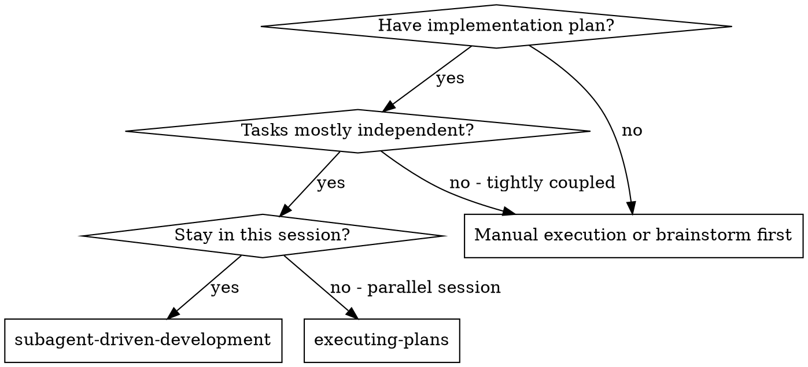
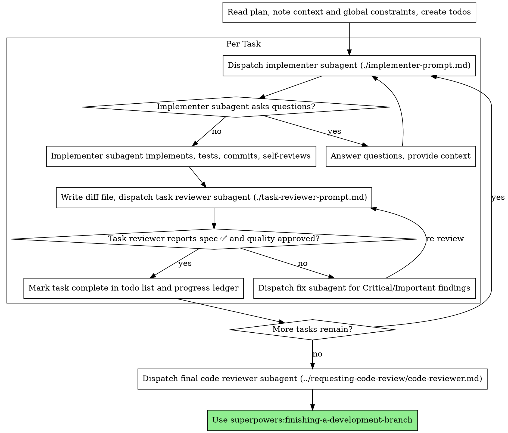

# Subagent-Driven Development

Execute plan by dispatching a fresh implementer subagent per task, a task review (spec compliance + code quality) after each, and a broad whole-branch review at the end.

**Why subagents:** You delegate tasks to specialized agents with isolated context. By precisely crafting their instructions and context, you ensure they stay focused and succeed at their task. They should never inherit your session's context or history — you construct exactly what they need. This also preserves your own context for coordination work.

**Core principle:** Fresh subagent per task + task review (spec + quality) + broad final review = high quality, fast iteration

**Narration:** between tool calls, narrate at most one short line — the
ledger and the tool results carry the record.

**Continuous execution:** Do not pause to check in with your human partner between tasks. Execute all tasks from the plan without stopping. The only reasons to stop are: BLOCKED status you cannot resolve, ambiguity that genuinely prevents progress, or all tasks complete. "Should I continue?" prompts and progress summaries waste their time — they asked you to execute the plan, so execute it.

## When to Use



**vs. Executing Plans (parallel session):**
- Same session (no context switch)
- Fresh subagent per task (no context pollution)
- Review after each task (spec compliance + code quality), broad review at the end
- Faster iteration (no human-in-loop between tasks)

## OpenSpec Apply mode

When called by OpenSpec Apply, execute only the accepted repository scope and
return verification evidence to the caller. Do not invoke
finishing-a-development-branch automatically: publication, merge and Store Git
remain separate authorized actions. Track micro-steps in local scratch; only
completed coarse Tasks are checked in the Store by the Apply coordinator.

## The Process



## Pre-Flight Plan Review

Before dispatching Task 1, scan the plan once for conflicts:

- tasks that contradict each other or the plan's Global Constraints
- anything the plan explicitly mandates that the review rubric treats as a
  defect (a test that asserts nothing, verbatim duplication of a logic block)

Present everything you find to your human partner as one batched question —
each finding beside the plan text that mandates it, asking which governs —
before execution begins, not one interrupt per discovery mid-plan. If the
scan is clean, proceed without comment. The review loop remains the net for
conflicts that only emerge from implementation.

## Model Selection

Follow the user and project model policy and the actual dispatch tool capabilities.
Inherit the current model unless an explicit policy or instruction authorizes an
override. Specify a model only when supported and needed to implement that policy;
do not assume model names, tiers, prices, availability or inheritance semantics.
Task complexity and risk inform the required capability, not a fixed file-count
threshold. If the permitted environment cannot meet a required capability, report
that limitation without silently choosing another model.

## Handling Implementer Status

Implementer subagents report one of four statuses. Handle each appropriately:

**DONE:** Follow Review Snapshot Handoff below. Generate or verify the package
for the returned committed or uncommitted state, then dispatch the task reviewer
with its path. BASE is the full commit recorded before dispatch, never `HEAD~1`.

**DONE_WITH_CONCERNS:** The implementer completed the work but flagged doubts. Read the concerns before proceeding. If the concerns are about correctness or scope, address them before review. If they're observations (e.g., "this file is getting large"), note them and proceed to review.

**NEEDS_CONTEXT:** The implementer needs information that wasn't provided. Provide the missing context and re-dispatch.

**BLOCKED:** The implementer cannot complete the task. Assess the blocker:
1. If it's a context problem, provide more context and re-dispatch with the same model
2. If the task requires more reasoning, follow Model Selection before re-dispatching with a more capable model; if no permitted model is available, provide additional context, decompose the task or report the limitation
3. If the task is too large, break it into smaller pieces
4. If the plan itself is wrong, escalate to the human

**Never** ignore an escalation or force the same model to retry without changes. If the implementer said it's stuck, something needs to change.

## Review Snapshot Handoff

Pass repository ID, absolute checkout, full base SHA, explicitly owned task paths,
absolute helper path and a package output path to the implementer. Reports and
packages belong outside the checkout or in Git-ignored scratch.

- Committed result: `review-package BASE HEAD OUTFILE`.
- Uncommitted result: `review-package BASE --worktree OUTFILE -- PATH [PATH ...]`.
  Run from the assigned checkout. Include all task paths, including new files,
  deletions and both sides of renames; never use a broad scope containing others'
  work. The snapshot includes BASE-to-HEAD committed changes plus the selected
  working-tree state over HEAD; confirm that the commit range is task-owned too.
- Compare the report's repository, checkout, base, HEAD and snapshot tree SHA
  with the package before dispatch. A mismatch or missing identity requires
  fresh verification, not approval based on an older report. If unrelated dirty
  code influenced tests, resolve the limitation before accepting exact-snapshot
  evidence. Freeze edits during snapshot creation and verification handoff.
- Give these identities to the reviewer. After fixes, regenerate the package and
  obtain test evidence for the new tree. Do not substitute BASE..HEAD for a
  worktree result, even when no commits were made.
- Record uncommitted completion with its snapshot SHA and owned paths in the
  ledger, explicitly marked uncommitted. The ancestor-based reuse rule below
  applies only to committed results; for uncommitted results regenerate the
  snapshot and compare the tree and test/review evidence before reuse.
- The final whole-branch review follows the same rule if work remains uncommitted,
  using the accepted branch base and the full authorized implementation path set.

## Handling Reviewer ⚠️ Items

The task reviewer may report "⚠️ Cannot verify from diff" items — requirements
that live in unchanged code or span tasks. These do not block the rest of the
review, but you must resolve each one yourself before marking the task
complete: you hold the plan and cross-task context the reviewer
lacks. If you confirm an item is a real gap, treat it as a failed spec
review — send it back to the implementer and re-review.

## Passing Active Rules to Subagents

For every implementer, reviewer, fix and re-review dispatch, include the active
rules applicable to that task and checkout in the existing Global Constraints
block, alongside plan/spec requirements. Copy the relevant instructions themselves,
including their scope, required tools, invocation order and permitted fallbacks.
Include session-only instructions supplied by connected Extensions or Plugins;
reading checkout instructions does not recover them. Do not assume a fresh
subagent inherits the parent's session or tool access. If a required tool is
unavailable to the subagent, resolve the handoff or use the rule's stated fallback;
do not silently drop the rule. Refresh this block when applicable rules change.

## Constructing Reviewer Prompts

Per-task reviews are task-scoped gates. The broad review happens once, at the
final whole-branch review. When you fill a reviewer template:

- Do not add open-ended directives like "check all uses" or "run race tests
  if useful" without a concrete, task-specific reason
- Do not ask a reviewer to re-run tests the implementer already ran on the
  same code — the implementer's report carries the test evidence
- Do not pre-judge findings for the reviewer — never instruct a reviewer to
  ignore or not flag a specific issue. If you believe a finding would be a
  false positive, let the reviewer raise it and adjudicate it in the review
  loop. If the prompt you are writing contains "do not flag," "don't treat X
  as a defect," "at most Minor," or "the plan chose" — stop: you are
  pre-judging, usually to spare yourself a review loop.
- The global-constraints block you hand the reviewer is its attention
  lens. Copy the binding requirements verbatim from the plan's Global
  Constraints section or the spec: exact values, exact formats, and the
  stated relationships between components ("same layout as X", "matches
  Y"). Also include the applicable active rules described above. The template
  carries generic review practices; it does not contain project-specific or
  session-only execution rules.
- Hand the reviewer its diff as a file: run `scripts/review-package` in the
  appropriate mode from Review Snapshot Handoff and pass its printed path.
  Without Bash, a committed package can be assembled from `git log --oneline`,
  `git diff --stat`, and `git diff --binary -U10` for the exact range, plus the
  checkout, full base/HEAD and tree SHA. If the worktree helper cannot run,
  report the limitation instead of substituting a committed diff. The output never enters your own context, and the reviewer sees
  the commit list, stat summary, and full diff with context in one Read
  call. Use the BASE you recorded before dispatching the implementer —
  never `HEAD~1`, which silently truncates multi-commit tasks.
- A dispatch prompt describes one task, not the session's history. Do not
  paste accumulated prior-task summaries ("state after Tasks 1-3") into
  later dispatches — a real session's dispatch hit 42k chars of which 99%
  was pasted history. A fresh subagent needs its task, the interfaces it
  touches, and the global constraints. Nothing else.
- Dispatch fix subagents for Critical and Important findings. Record Minor
  findings in the progress ledger as you go, and point the final
  whole-branch review at that list so it can triage which must be fixed
  before merge. A roll-up nobody reads is a silent discard.
- A finding labeled plan-mandated — or any finding that conflicts with
  what the plan's text requires — is the human's decision, like any plan
  contradiction: present the finding and the plan text, ask which governs.
  Do not dismiss the finding because the plan mandates it, and do not
  dispatch a fix that contradicts the plan without asking.
- The final whole-branch review gets a package too: run
  `scripts/review-package MERGE_BASE HEAD` (MERGE_BASE = the commit the
  branch started from, e.g. `git merge-base main HEAD`) and include the
  printed path in the final review dispatch, so the final reviewer reads
  one file instead of re-deriving the branch diff with git commands. For an
  uncommitted result use Review Snapshot Handoff with MERGE_BASE instead.
- Every fix dispatch carries the implementer contract: the fix subagent
  re-runs the tests covering its change and reports the results. Name the
  covering test files in the dispatch — a one-line fix does not need the
  whole suite. Before re-dispatching the reviewer, confirm the fix report
  contains the covering tests, the command run, and the output; dispatch
  the re-review once all three are present.
- If the final whole-branch review returns findings, dispatch ONE fix
  subagent with the complete findings list — not one fixer per finding.
  Per-finding fixers each rebuild context and re-run suites; a real
  session's final-review fix wave cost more than all its tasks combined.

## File Handoffs

Invoke helper scripts by their absolute skill path while keeping the working
directory in the assigned Code Repository. Do not change into the Extension
installation directory to run Git helpers. Pass the exact accepted plan path.

Everything you paste into a dispatch prompt — and everything a subagent
prints back — stays resident in your context for the rest of the session
and is re-read on every later turn. Hand artifacts over as files:

- **Task brief:** before dispatching an implementer, run this skill's
  `scripts/task-brief PLAN_FILE N --repo REPOSITORY_ID` for a repository-sectioned
  plan (omit `--repo` only for a single-repository plan) — it extracts the task's full text to a
  uniquely named file and prints the path. Compose the dispatch so the
  brief stays the single source of requirements. Your dispatch should
  contain: (1) one line on where this task fits in the project; (2) the
  brief path, introduced as "read this first — it is your requirements,
  with the exact values to use verbatim"; (3) interfaces and decisions
  from earlier tasks that the brief cannot know; (4) your resolution of
  any ambiguity you noticed in the brief; (5) the report-file path and
  report contract. Exact values (numbers, magic strings, signatures, test
  cases) appear only in the brief. Include a separate required Global Constraints
  block with plan/spec requirements and applicable active execution rules,
  plus the repository ID, checkout, full base SHA,
  TDD requirement and authorized commit scope. The extractor selects task text only;
  it does not copy these plan-level constraints.
- **Report file:** name the implementer's report file after the brief
  (brief `…/task-N-brief.md` → report `…/task-N-report.md`) and put it in
  the dispatch prompt. The implementer writes the full report there and
  returns only status, commits, a one-line test summary, and concerns.
- **Reviewer inputs:** the task reviewer gets three paths — the same brief
  file, the report file, and the review package — plus the global
  constraints that bind the task.
- Fix dispatches append their fix report (with test results) to the same
  report file and return a short summary; re-reviews read the updated file.

## Durable Progress

Conversation memory does not survive compaction. In real sessions,
controllers that lost their place have re-dispatched entire completed task
sequences — the single most expensive failure observed. Track progress in
a ledger file, not only in todos.

- At skill start, run `scripts/sdd-workspace PLAN_FILE` from the assigned Code
  Repository and use only `<returned-directory>/progress.md`. Without Bash, use
  `node <skill-directory>/scripts/task-context.cjs workspace PLAN_FILE`.
- The directory identity includes the exact plan path (and therefore Change), plan
  contents, checkout and branch. Changing any of these selects a new ledger. Never
  import the old unscoped `.superpowers/sdd/progress.md` automatically. A detached
  checkout also includes HEAD; revalidate evidence after HEAD changes.
- Record the exact repository ID, task number, full base and implementation commit
  SHAs, review result and verification evidence. Before reusing a completed entry,
  confirm its repository/task identity, that both commits exist and the implementation
  commit is an ancestor of current HEAD, and that recorded review and checks apply to
  this plan. Missing or conflicting evidence requires revalidation, not a silent skip.
- Append completion only after task review and required checks pass. After compaction,
  resume using this scoped ledger and verified Git evidence; do not trust task numbers
  alone. Reverted or subsequently changed implementations require fresh verification.
- Task briefs and reports use the same plan-scoped workspace. The extractor accepts
  only one matching task, respects Markdown section boundaries and ignores headings
  inside fenced code. Missing or ambiguous tasks stop dispatch without overwriting
  an existing brief. For platforms without Bash, use
  `node <skill-directory>/scripts/task-context.cjs brief PLAN_FILE N --repo REPOSITORY_ID`.
- The ledger is ignored scratch, not an acceptance artifact. If removed, recover from
  the accepted plan and current Git/test evidence instead of assuming completion.

## Prompt Templates

- [implementer-prompt.md](implementer-prompt.md) - Dispatch implementer subagent
- [task-reviewer-prompt.md](task-reviewer-prompt.md) - Dispatch task reviewer subagent (spec compliance + code quality)
- Final whole-branch review: use superpowers:requesting-code-review's [code-reviewer.md](../requesting-code-review/code-reviewer.md)

## Example Workflow

```
You: I'm using Subagent-Driven Development to execute this plan.

[Read plan file once: docs/superpowers/plans/feature-plan.md]
[Create todos for all tasks]

Task 1: Hook installation script

[Run task-brief for Task 1; dispatch implementer with brief + report paths + context]

Implementer: "Before I begin - should the hook be installed at user or system level?"

You: "User level (~/.config/superpowers/hooks/)"

Implementer: "Got it. Implementing now..."
[Later] Implementer:
  - Implemented install-hook command
  - Added tests, 5/5 passing
  - Self-review: Found I missed --force flag, added it
  - Committed

[Run review-package, dispatch task reviewer with the printed path]
Task reviewer: Spec ✅ - all requirements met, nothing extra.
  Strengths: Good test coverage, clean. Issues: None. Task quality: Approved.

[Mark Task 1 complete]

Task 2: Recovery modes

[Run task-brief for Task 2; dispatch implementer with brief + report paths + context]

Implementer: [No questions, proceeds]
Implementer:
  - Added verify/repair modes
  - 8/8 tests passing
  - Self-review: All good
  - Committed

[Run review-package, dispatch task reviewer with the printed path]
Task reviewer: Spec ❌:
  - Missing: Progress reporting (spec says "report every 100 items")
  - Extra: Added --json flag (not requested)
  Issues (Important): Magic number (100)

[Dispatch fix subagent with all findings]
Fixer: Removed --json flag, added progress reporting, extracted PROGRESS_INTERVAL constant

[Task reviewer reviews again]
Task reviewer: Spec ✅. Task quality: Approved.

[Mark Task 2 complete]

...

[After all tasks]
[Dispatch final code-reviewer]
Final reviewer: All requirements met, ready to merge

Done!
```

## Advantages

**vs. Manual execution:**
- Subagents follow TDD naturally
- Fresh context per task (no confusion)
- Parallel-safe (subagents don't interfere)
- Subagent can ask questions (before AND during work)

**vs. Executing Plans:**
- Same session (no handoff)
- Continuous progress (no waiting)
- Review checkpoints automatic

**Efficiency gains:**
- Controller curates exactly what context is needed; bulk artifacts move
  as files, not pasted text
- Subagent gets complete information upfront
- Questions surfaced before work begins (not after)

**Quality gates:**
- Self-review catches issues before handoff
- Task review carries two verdicts: spec compliance and code quality
- Review loops ensure fixes actually work
- Spec compliance prevents over/under-building
- Code quality ensures implementation is well-built

**Cost:**
- More subagent invocations (implementer + reviewer per task)
- Controller does more prep work (extracting all tasks upfront)
- Review loops add iterations
- But catches issues early (cheaper than debugging later)

## Red Flags

**Never:**
- Start implementation on a protected or integration branch identified by repository policy without explicit user authorization
- Skip task review, or accept a report missing either verdict (spec compliance AND task quality are both required)
- Proceed with unfixed issues
- Dispatch multiple implementation subagents in parallel (conflicts)
- Make a subagent read the whole plan file (hand it its task brief —
  `scripts/task-brief` — instead)
- Skip scene-setting context (subagent needs to understand where task fits)
- Ignore subagent questions (answer before letting them proceed)
- Accept "close enough" on spec compliance (reviewer found spec issues = not done)
- Skip review loops (reviewer found issues = implementer fixes = review again)
- Let implementer self-review replace actual review (both are needed)
- Tell a reviewer what not to flag, or pre-rate a finding's severity in the
  dispatch prompt ("treat it as Minor at most") — the plan's example code is
  a starting point, not evidence that its weaknesses were chosen
- Dispatch a task reviewer without a diff file — generate it first
  (using Review Snapshot Handoff) and name the printed path in the
  prompt
- Move to next task while the review has open Critical/Important issues
- Re-dispatch a task the progress ledger already marks complete — check
  the ledger (and `git log`) after any compaction or resume

**If subagent asks questions:**
- Answer clearly and completely
- Provide additional context if needed
- Don't rush them into implementation

**If reviewer finds issues:**
- Implementer (same subagent) fixes them
- Reviewer reviews again
- Repeat until approved
- Don't skip the re-review

**If subagent fails task:**
- Dispatch fix subagent with specific instructions
- Don't try to fix manually (context pollution)

## Integration

**Required workflow skills:**
- **superpowers:using-git-worktrees** - Ensures isolated workspace (creates one or verifies existing)
- **superpowers:writing-plans** - Creates the plan this skill executes
- **superpowers:requesting-code-review** - Code review template for the final whole-branch review
- **superpowers:finishing-a-development-branch** - Complete development after all tasks

**Subagents should use:**
- **superpowers:test-driven-development** - Subagents follow TDD for each task

**Alternative workflow:**
- **superpowers:executing-plans** - Use for parallel session instead of same-session execution
